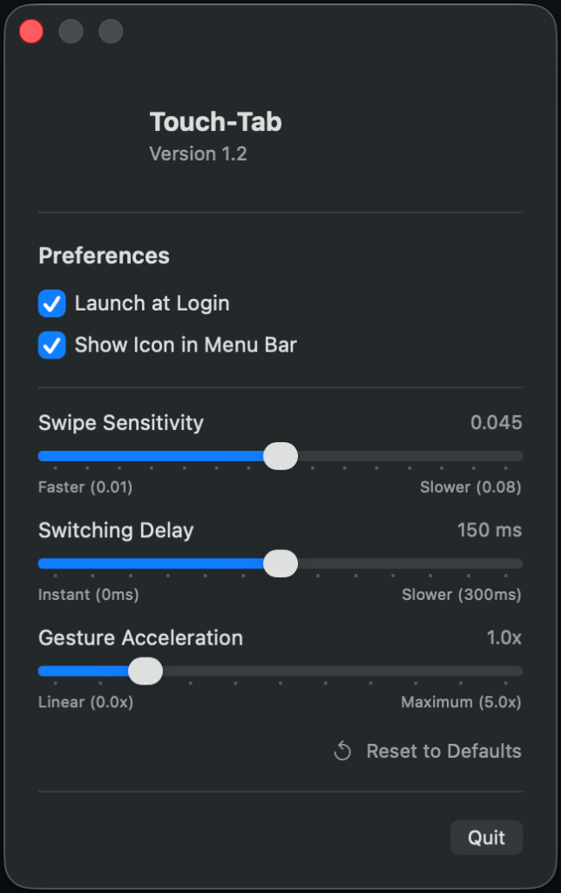

# Touch-Tab

Switch apps with trackpad on macOS. Forked from [ris58h/Touch-Tab](https://github.com/ris58h/Touch-Tab) with improvements.

在 macOS 上通过触控板三指轻扫切换应用。基于原版的改进版本。

<p align="center">
  
</p>

---

## 🇨🇳 中文说明

### 🌟 功能特点
* **三指轻扫切换**：三指左右轻扫切换应用，轻扫并按住可呼出系统应用切换器（App Switcher）窗口。
* **参数自定义**：支持在首选项中调节轻扫灵敏度、延迟与手势加速度，以适配个人使用习惯。
* **滚动拦截**：在轻扫切换应用时，拦截发送给后台窗口的滚动事件，避免导致后台窗口内容意外滚动。
* **状态栏图标隐藏**：支持隐藏菜单栏图标，隐藏后应用在后台运行。
* **开机自启动**：支持在首选项中开启或关闭开机自启。

### 📦 下载与安装

> [!IMPORTANT]
> **系统要求**：本版本基于 Swift 6 与 Observation 框架，仅支持 **macOS 14.0 (Sonoma) 及以上系统**。
> 
> **⚠️ 触控板设置**：运行本应用前，**需关闭或更改 macOS 默认的三指轻扫手势**。请前往 `系统设置 > 触控板 > 更多手势 > 在全屏幕应用之间轻扫`，将其关闭或改为“四指轻扫”。否则系统默认手势会占用三指事件，导致本应用的手势失效。

1. **下载**：前往 [Releases 页面](https://github.com/Shell-human/Touch-Tab/releases) 下载最新的 **`Touch-Tab.dmg`**。
2. **安装**：双击 `.dmg` 文件，将 **Touch-Tab** 拖入 **Applications**（应用程序）文件夹。
3. **系统权限配置**：
   * **辅助功能权限**：前往 `系统设置 > 隐私与安全性 > 辅助功能`，开启 **Touch-Tab** 的权限。
   * **⚠️ 三指拖移**：若在 `系统设置 > 辅助功能 > 指针控制 > 触控板选项` 中启用了“三指拖移”，**需将其关闭**（或更改为其他拖移方式）。否则三指滑动会被系统优先识别为窗口拖拽或文本选择，与本应用的手势冲突。

### 💡 使用提示
> [!TIP]
> **版本升级/重新安装**：若更新版本后手势失效，请前往 `系统设置 > 隐私与安全性 > 辅助功能`，在列表中选中 **Touch-Tab** 并点击底部的 **`-` (减号)** 将其移除，然后点击 **`+` (加号)** 重新添加新版 Touch-Tab 并开启授权。

> [!NOTE]
> **重新显示菜单栏图标**：若已在首选项中隐藏菜单栏图标，从应用程序文件夹或通过 Launchpad / Spotlight **再次运行 Touch-Tab** 即可重新打开首选项窗口。

### 🛠 编译开发
若需自行编译：
```bash
chmod +x build_app.sh
./build_app.sh
```
编译生成的 `.app` 包和 `.dmg` 安装盘将存放在 `build/` 目录下。

---

## 🇺🇸 English Guide

### 🌟 Features
* **3-Finger Swipe**: Swipe left or right with three fingers to switch apps; swipe and hold to display the macOS App Switcher UI.
* **Custom Settings**: Adjust swipe sensitivity, delay, and gesture acceleration in Preferences to match your preference.
* **Background Scroll Interception**: Intercepts scroll events during application switching to prevent background window content from scrolling.
* **Hide Menu Bar Icon**: Toggle the visibility of the status bar icon; when hidden, the application runs in the background.
* **Launch at Login**: Enable or disable autostart directly from the Preferences window.

### 📦 Download & Installation

> [!IMPORTANT]
> **System Requirements**: This version requires **macOS 14.0 (Sonoma) or newer**.
> 
> **⚠️ Trackpad Settings**: Before running the application, you **must disable or modify the system default 3-finger swipe gesture**. Open `System Settings > Trackpad > More Gestures > Swipe between full-screen apps`, and disable it or change it to "Swipe with four fingers". Otherwise, the default system gesture will intercept the swipe, causing Touch-Tab to fail.

1. **Download**: Go to the [Releases page](https://github.com/Shell-human/Touch-Tab/releases) and download the latest **`Touch-Tab.dmg`**.
2. **Install**: Double-click the `.dmg` file and drag **Touch-Tab** into your **Applications** folder.
3. **System Configuration**:
   * **Accessibility**: Open `System Settings > Privacy & Security > Accessibility` and authorize **Touch-Tab**.
   * **⚠️ Three-Finger Drag**: If you have enabled "Three Finger Drag" under `System Settings > Accessibility > Pointer Control > Trackpad Options`, you **must disable it** (or change it to another setting). Otherwise, three-finger swipes will be captured for window dragging or text selection, conflicting with Touch-Tab.

### 💡 Tips
> [!TIP]
> **Reinstallation / Upgrade**: If gestures do not work after upgrading, go to `System Settings > Privacy & Security > Accessibility`, select the old **Touch-Tab** entry, click the **`-` (minus)** button to remove it, and click the **`+` (plus)** button to re-add the new Touch-Tab application.

> [!NOTE]
> **Restore Menu Bar Icon**: If you hid the menu bar icon, **re-launch Touch-Tab** from your Applications folder or via Launchpad / Spotlight to reopen the Preferences window.

### 🛠 Compilation
To build the application manually:
```bash
chmod +x build_app.sh
./build_app.sh
```
The compiled app bundle and DMG installer will be saved to the `build/` directory.
