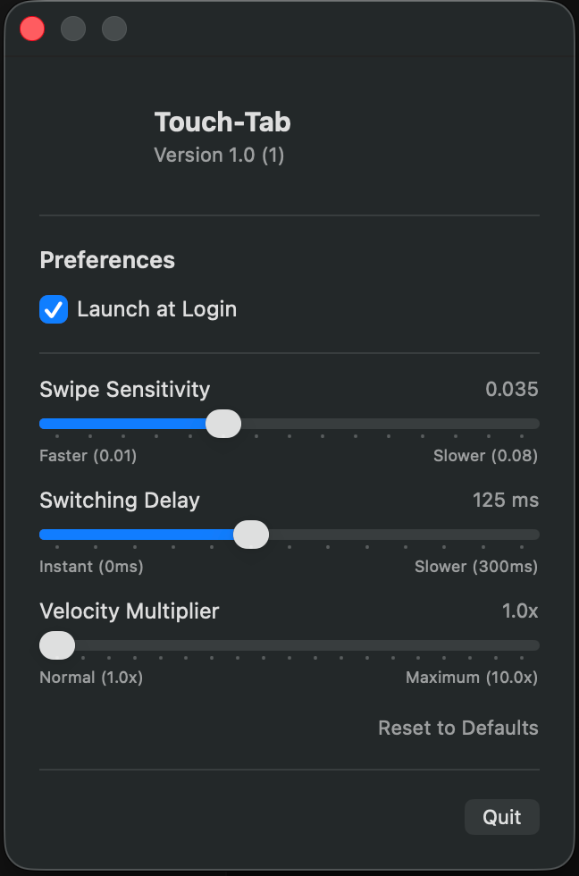

# Touch-Tab

Switch apps with trackpad on macOS. This is an enhanced, highly polished, and modernized version of the original Touch-Tab app.

在 macOS 上用触控板三指轻扫快速切换应用程序。此版本为精心重构与打磨后的现代化增强版。

<p align="center">
  
</p>

---

## 中文介绍

### 🌟 核心功能
* **三指轻扫切换 App**：在触控板上使用三个手指左右轻扫，即可在活跃应用之间快速来回切换。轻扫后按住或慢速滑动将呼出 macOS 系统默认的 App 切换器 UI（Command+Tab 窗口）。
* **首选项设置面板**：点击状态栏图标选择 `Preferences...` 即可开启全新的配置窗口，支持：
  * **滑动灵敏度 (Swipe Sensitivity)**：自由微调手势触发门槛（默认 `0.035`），防止触控板误触或让滑动反馈极其敏锐。
  * **切换延迟 (Switching Delay)**：设置连续切换之间的保护时间（默认 `125 ms`），使快速滑动切换变得更加平顺受控，也可设为 `0 ms` 体验完全无延迟极速响应。
  * **速度乘数 (Velocity Multiplier)**：在保持合理起步门槛的同时，可放大你快速滑动时的手势位移速度（默认 `1.0x`，最高支持 `10.0x`），让你在快滑时能像“飞轮 (Flywheel)”一样连续跳过多个 App。
  * **一键恢复默认 (Reset to Defaults)**：随时将所有灵敏度及延迟参数重置回精心打磨的最佳黄金比例默认值。
* **背景滚动拦截 (Bug 修复)**：**彻底修复了官方原版在滑动切换时会导致后台网页/文档跟着滚动的 Bug (Issue #1)**。现在横向三指手势事件在触发切换后会被 Touch-Tab 自动吞除（Swallow）拦截，保证后台窗口静止；而纵向手势（如上滑呼出 Mission Control）依然保持放行，不影响系统功能。
* **开机自启动**：增加了一键勾选的 “Launch at Login” 开关，采用 macOS 13+ 最新的安全后台服务管理 API (`SMAppService`) 注册自启。

### 🛠 极简现代架构 (Swift 6 + SwiftUI)
* 整个软件被重新打磨，去除了所有旧式的 AppKit 生命周期 boilerplate 和 `Combine` 状态流，目前**仅由 3 个极其高内聚的 Swift 文件组成**。
* 核心逻辑采用 **Swift 6.0 声明式 App 协议**、**`MenuBarExtra` 状态栏菜单声明**以及最新的 **Observation 观测框架 (`@Observable` / `@Bindable`)** 实现，是 macOS 平台极简、高效开发的教科书式规范样板。

---

## English Introduction

### 🌟 Key Features
* **3-Finger Swipe Switching**: Swipe left or right with 3 fingers to switch between active apps. Hold after a swipe or swipe slowly to bring up the macOS system App Switcher UI.
* **Unified Preferences Panel**: Tap the menu bar icon and select `Preferences...` to access customization sliders:
  * **Swipe Sensitivity**: Fine-tune the distance threshold (default: `0.035`) to avoid accidental triggers or to make the gestures incredibly sensitive.
  * **Switching Delay**: Add a guard delay between consecutive switches (default: `125 ms`) for smoother controls, or set it to `0 ms` for instant reactive response.
  * **Velocity Multiplier**: Amplify finger velocity (default: `1.0x`, up to `10.0x`) during fast swipes, allowing you to skip multiple apps in a "flywheel" style.
  * **Reset to Defaults**: Instantly restore all settings to their carefully calculated golden-ratio default values.
* **Background Scrolling Swallow (Bug Fix)**: **Completely resolves the long-standing issue where swiping scrolls background app content (Issue #1)**. Horizontal 3-finger swipe gestures are now swallowed by Touch-Tab, keeping browser windows in the background completely static, while vertical system swipes (e.g., Mission Control) remain fully active.
* **Launch at Login**: Easily toggle start-on-boot directly from the Preferences panel, powered by macOS 13+ modern `SMAppService` APIs.

### 🛠 Modern Swift 6 & SwiftUI Implementation
* The app lifecycle has been fully refactored, removing AppKit App Delegate boilerplate and Combine observers. The entire project is **streamlined into just 3 source files**.
* Built using **Swift 6.0 Declarative App Structure**, **`MenuBarExtra` Menu Scenes**, and the new **Observation framework (`@Observable` / `@Bindable`)** to deliver a textbook-clean, modern, and high-performance implementation.

---

## 安装与配置 / Installation & Setup

1. **下载或编译项目 / Download & Compile**:
   * 你可以使用项目根目录下的 `./build_app.sh` 脚本在终端一键编译，编译后的 `Touch-Tab.app` 将在 `build` 目录中生成。
   * Move `Touch-Tab.app` to your `/Applications` (应用程序) folder.

2. **授予辅助功能权限 / Grant Accessibility Permissions**:
   * macOS 需要开启控制权限来监听手势并模拟键盘事件。
   * Open `System Settings > Privacy & Security > Accessibility` (系统设置 > 隐私与安全 > 辅助功能).
   * Enable/Authorize **Touch-Tab**. If updating, we recommend removing Touch-Tab from the list first (click `-`) and adding it again (click `+`).

3. **禁用系统 3 指滑动冲突 / Resolve System Gesture Conflict**:
   * 系统默认的 3 指全屏滑动会拦截 Touch-Tab 的事件，需要进行微调。
   * Open `System Settings > Trackpad > More Gestures > Swipe between full-screen apps` (系统设置 > 触控板 > 更多手势 > 在全屏幕应用之间轻扫).
   * **Disable** the option or change it to **4-finger swipe** (用四个手指轻扫).

---

## 编译运行 / Compilation & Packaging

Make the build script executable and run it to compile and package the app bundle:
```bash
chmod +x build_app.sh
./build_app.sh
```
The packaged app bundle will be located at `build/Touch-Tab.app`.
